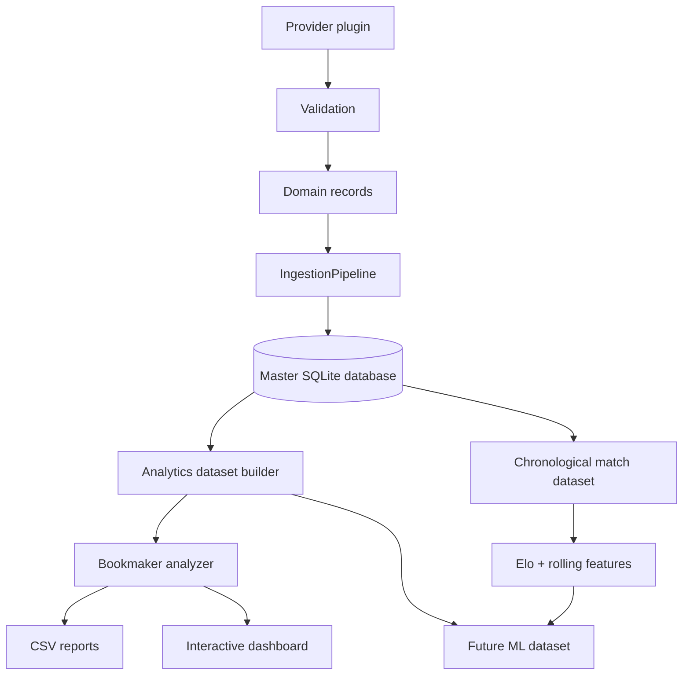

> **DEPRECATO — snapshot storico.** La fonte mantenuta per architettura,
> pipeline e feature è `docs-app/src/docs.ts`.

# Architettura

Il framework separa acquisizione, persistenza, feature engineering e analisi.
Ogni sorgente esterna implementa `DataProvider`; tutto ciò che segue opera
soltanto su record di dominio o sul database normalizzato.



## Moduli

- `domain.py`: record immutabili e indipendenti dal provider.
- `providers/base.py`: contratto unico per ogni sorgente.
- `providers/football_data.py`: adattatore Football-Data.
- `database.py`: schema relazionale e repository SQLite.
- `ingestion.py`: pipeline di caricamento sostituibile.
- `analytics_dataset.py`: dataset derivato, una riga per previsione.
- `analyzer.py`: metriche e confronti bookmaker/campionati/timing.
- `reporting.py`: tabelle, grafici esportabili e dashboard HTML.
- `elo.py`: motore Elo dinamico e regressione stagionale.
- `modeling_dataset.py`: feature lette prima del risultato corrente.
- `modeling_reporting.py`: audit di completezza e pattern interpretabili.
- `baseline_modeling.py`: confronto walk-forward tra mercato e baseline sportive.
- `pipeline.py`: mantiene la pipeline MVP e aggiunge quella di ricerca.

## Estendere i provider

Un nuovo provider deve implementare:

```python
class NewProvider:
    name = "New provider"

    def matches(self) -> list[MatchRecord]: ...
    def odds(self) -> list[OddsRecord]: ...
```

Non sono necessarie modifiche a database, analizzatori o report.

## Identità delle partite

`matches.match_id` è un UUID generato internamente. Gli identificativi delle
sorgenti sono conservati esclusivamente in `provider_match_mapping`. Una
chiave naturale controllata permette a provider diversi di convergere sullo
stesso incontro senza rendere il sistema dipendente dai loro ID.

La convergenza confronta il giorno, la lega e le due squadre, tollerando
differenze nell'ora o nella timezone dichiarata dai provider. Le quote
mantengono invece `provider_id` nella propria identità: due sorgenti possono
riportare lo stesso bookmaker senza sovrascriversi.

## Estensioni future

Le tabelle per giocatori, Elo, forma, classifica, calendario, trasferte, meteo
e arbitri sono presenti ma intenzionalmente prive di logica applicativa. I
futuri feature builder potranno leggere queste tabelle e produrre dataset per
CatBoost, XGBoost o ensemble senza modificare l'ingestione delle quote.

## Garanzia temporale

La pipeline modellistica ordina le partite cronologicamente. Per ogni incontro:

1. legge rating, forma e riposo correnti;
2. salva le feature pre-partita;
3. aggiorna gli storici con gol e risultato;
4. aggiorna l'Elo.

I test verificano che aggiungere una partita futura non modifichi le feature
già calcolate sulle partite precedenti.
